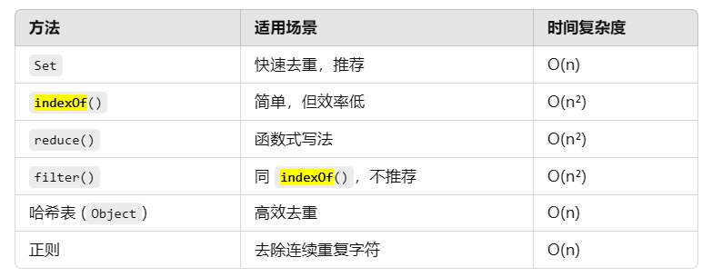

#### [415. 字符串相加](https://leetcode.cn/problems/add-strings/)
```javascript
var addStrings = function(num1, num2) {
    let len = Math.max(num1.length, num2.length);
    num1 = num1.padStart(len, '0');
    num2 = num2.padStart(len, '0');
    let carry = 0;
    let result = '';
    for(let i=len-1; i>=0; i--){
        let sum = parseInt(num1[i]) + parseInt(num2[i]) + carry;
        carry = Math.floor(sum/10);
        result = (sum%10) + result;
    }
    if(carry){
        result = carry + result;
    }
    return result;
};
```

#### [20.有效的括号](https://leetcode.cn/problems/valid-parentheses/)
```javascript
var isValid = function(s) {
    if(s.length % 2){
        return false
    }
    const dic = {'(':')', '[':']', '{':'}'};
    let res = [];
    for(const t of s){
        if(dic[t]){// 有右括号，说明它是左括号
            res.push(dic[t])// 将其对应的右括号进栈
        }else if(res.length === 0||res.pop()!==t){// 右括号不匹配，栈里右多余
            return false
        }
    }
    return res.length===0
};
```

#### [1556. 千位分隔数](https://leetcode.cn/problems/thousand-separator/)
```javascript
/**
 * @param {number} n
 * @return {string}
 */
var thousandSeparator = function(n) {
    let a = n.toString();
    let count = 0;
    let res = []
    for(let i = a.length-1; i>=0; i--){
        count++;
        if(count<=3){
            res.push(a[i])
        }else{
            res.push(".");
            res.push(a[i]);
            count = 1;
        }
    }
    return res.reverse().join("")
};
```

#### 字符串去重


#### [BM83. 字符串变形](https://www.nowcoder.com/practice/c3120c1c1bc44ad986259c0cf0f0b80e?tpId=295&tqId=44664&ru=%2Fexam%2Foj&qru=%2Fta%2Fformat-top101%2Fquestion-ranking&sourceUrl=%2Fexam%2Foj%3FquestionJobId%3D10%26subTabName%3Donline_coding_page&dayCountBigMember=365%E5%A4%A9)
```javascript
function trans( s ,  n ) {
    // 把词分开
    const arr = s.split(" ").map((item)=>{
        let word = item.split('')
        // 把字母分开
        for(let i=0; i<word.length; i++){
            if(word[i].charCodeAt(0)<word[i].toLowerCase().charCodeAt(0)){
                word[i] = word[i].toLowerCase();
            }
            else{
                word[i] = word[i].toUpperCase();
            }
        }
        // 把字母合并
        return word.join('')
    })
    // 把词合并
    return arr.reverse().join(" ")
}
```
#### [BM84. 最长公共前缀](https://www.nowcoder.com/practice/28eb3175488f4434a4a6207f6f484f47?tpId=295&tags=&title=&difficulty=0&judgeStatus=0&rp=0&sourceUrl=%2Fexam%2Foj%3FquestionJobId%3D10%26subTabName%3Donline_coding_page)
```javascript
function longestCommonPrefix( strs ) {
    if(!strs.length){
        return ''
    }
    let maxLen = ''
    for(let i=0; i<strs[0].length; i++){
        let j=0;
        while(j<strs.length-1 ){
            if(strs[j][i] === strs[j+1][i]){
                j++
            }
            else{
                return maxLen
            }
        }
        maxLen += strs[0][i]
    }
    return maxLen
}
```