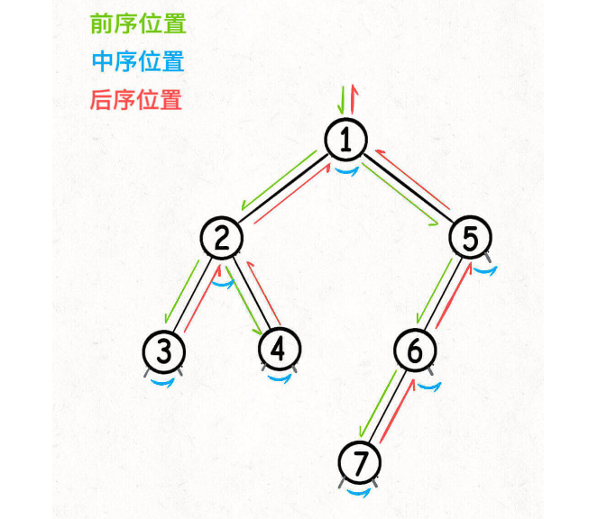
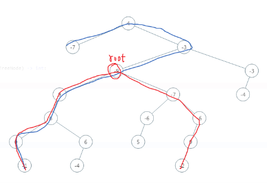

## 二叉树分类
1. 二叉树：分叉只有两个叉
2. 满二叉树：每一层都是满的
3. 完全二叉树：节点紧凑靠左排列，除最后一层都是满的
4. 二叉搜索树：「左子树的每个节点」的值都要小于这个节点的值，「右子树的每个节点」的值都要大于这个节点的值
---
## 二叉树的遍历
#### · 层序遍历（BFS）
```javascript
var levelTraverse = function(root) {
    if (root == null) return;
    var q = [];
    q.push(root);
    while (q.length != 0) {// 从上到下
        for (var i = 0; i < q.length; i++) {// 从左到右
            var cur = q.shift();
            if (cur.left != null) {
                q.push(cur.left);
            }
            if (cur.right != null) {
                q.push(cur.right);
            }
        }
    }
};
```
#### · 递归遍历（DFS）
二叉树的递归遍历其实是固定的，对于属性val、left、right，`习惯顺序就是先左再右地“读取”`


```javascript
var traverse = function(root) {
    if (root === null) {
        return;
    }
    traverse(root.left);
    traverse(root.right);
}
```
---
### 两种思维方式
两种都是递归
>【遍历】≈【回溯】：通过遍历一遍二叉树。关注点在节点间的「树枝」。(前中后序)
【分解】≈【动态规划】：通过子问题推导出原问题。关注点在子树
DFS 算法属于遍历的思路，它的关注点在单个「节点」。

两种思维方式的代码习惯
>【遍历】：traverse()不用返回值，靠外部变量更新计算结果。
>【分解】：递归函数需要返回值，且是子问题的计算结果。
（子树问题：给函数设置返回值，在后序位置做文章）

---
### 理解前中后序
**1. 链表的遍历**
```javascript
var traverse = function(head) {
    if (head == null) {
        return;
    }
    //前序位置
    traverse(head.next);
    // 后序位置
    //console.log(head.val);
};
```
只要是递归形式的遍历，都可以有前序和后序位置。

**2. 二叉树的遍历**
```javascript
var traverse = function(root) {
    if (root == null) {
        return;
    }
    // 前序位置
    traverse(root.left);
    // 中序位置
    traverse(root.right);
    // 后序位置
};
```
前中后序是遍历二叉树过程中处理每一个节点的三个特殊时间点
每个节点都有`唯一`属于自己的前中后序位置



    仔细观察，前中后序位置的代码，能力依次增强。
    「前序」位置的代码只能从函数参数中获取父节点传递来的数据。
    「中序」位置的代码不仅可以获取参数数据，还可以获取到左子树通过函数返回值传递回来的数据。
    「后序」位置的代码最强，不仅可以获取参数数据，还可以同时获取到左右子树通过函数返回值传递回来的数据。
    所以，某些情况下把代码移到后序位置效率最高；有些事情，只有后序位置的代码能做。

---
### 题目
#### [104. 二叉树的最大深度](https://leetcode.cn/problems/maximum-depth-of-binary-tree/description/)
【遍历】
DFS遍历中记录下单次最深的大小，然后再比较每一次哪次最深
1. 每个节点都有自己的前中后序位置👉应该在哪里增加深度，在哪里减少深度？
2. 什么时候 记录下 单次最深的时候？👉叶子结点
3. 每个节点都有自己的前中后序位置👉前中后序都可以进行判断是否是叶子结点

【分解】
最大深度=max（左子树最大深度，右子树最大深度）+1
1. 叶子结点时应该返回多少
2. 前中后序？

👉要先得到左右子树的深度，然后推出原树的深度

#### [144. 二叉树的前序遍历](https://leetcode.cn/problems/binary-tree-preorder-traversal/description/)
【分解】：结果 = 根节点+左子树的前序+右子树的前序

#### [543. 二叉树的直径](https://leetcode.cn/problems/diameter-of-binary-tree/description/)
【分解】：最大直径可能不经过根节点。

请思考：
1. 直径是什么？
2. 最大直径是什么？
3. 递归函数返回值是什么？
4. 而每次应当更新最新结果。

👉就是一个结点的左子树加上右子树的路径数
👉就是一个结点的最大左子树加上最大右子树的路径数。一个结点的最大左子树就是该结点的左结点的左右子树中的最大路径+1
👉该节点的左右子树的最大路径+1
👉最大直径可能不经过根节点。因此不能单纯返回根节点的结果。而是应该每次都要更新子节点的结果。

